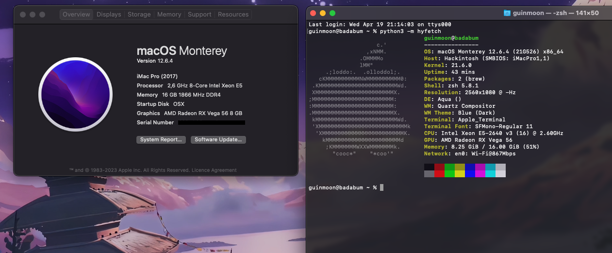

# Huananzhi-X99-TF-OpenCore
MacOS on Huananzhi X99 TF with OpenCore

OpenCore 0.8.8  
Tested on macOS 12.6.4 Monterey

## Hardware Configuration

| Part | Name | 
|:--:|:--|
| MB  | Huananzhi X99-TF  
| CPU | Intel 8-Core Intel Xeon E5-2640 v3 @ 2.60GHz
| Ram | 16GB (2 * 8) DDR4 1866 
| GPU | Gigabyte Radeon RX Vega56 8GB
| SSD | Samsung EVO970 512GB NVMe 
| SSD | NoName SATA 512GB                        

## Features

- [x] CPU Power Management (Not Tested)
- [x] GPU Supported, Metal GPUFamily macOS 2
- [x] Sleep/Wake 
- [x] 📶 Ethernet RTL8111
- [x] 📶 Broadcom BCM43xx WiFi+Bluetooth
- [x] 🔌 USB Ports  
- [x] 🎧 Realtek ALC892 Audio (AppleALC.kext)
- [x] Airdrop
- [x] Continuity
- [x] iCloud, AppStore, iMessage, etc.

# Don't forget to generate your own PlatformInfo options
- SystemUUID
- SystemSerialNumber
- MLB
- ROM

https://dortania.github.io/OpenCore-Post-Install/universal/iservices.html